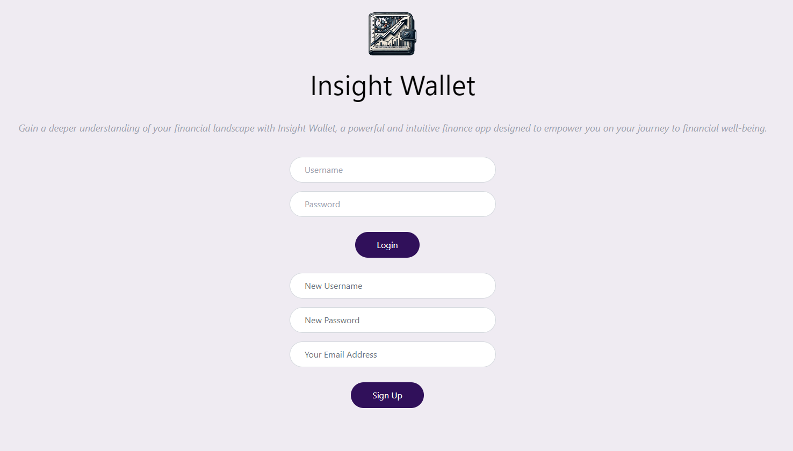
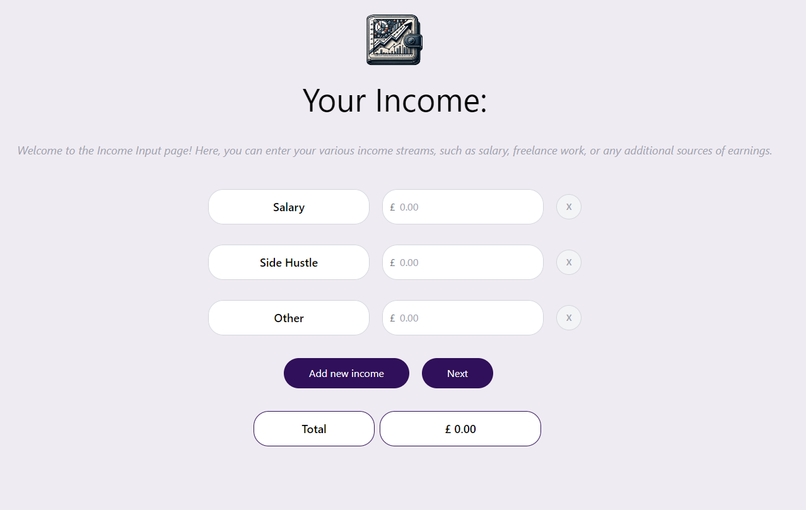
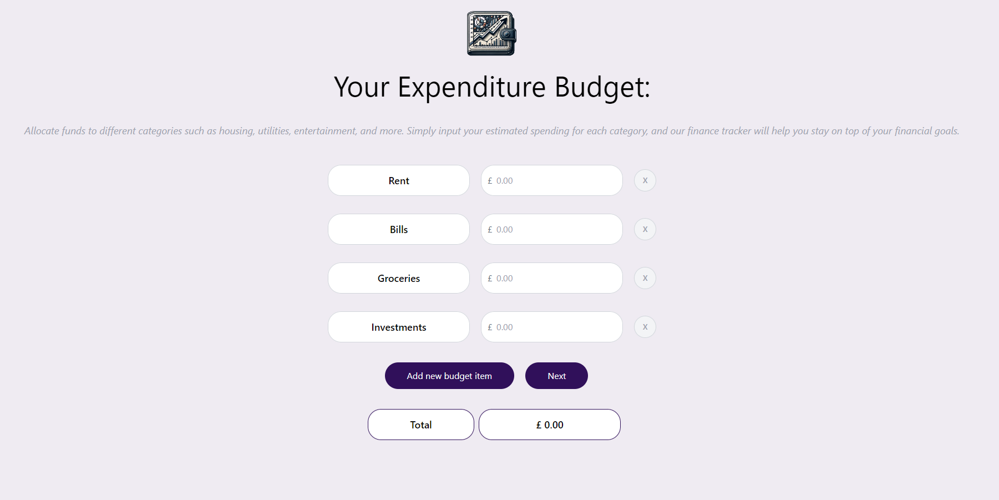
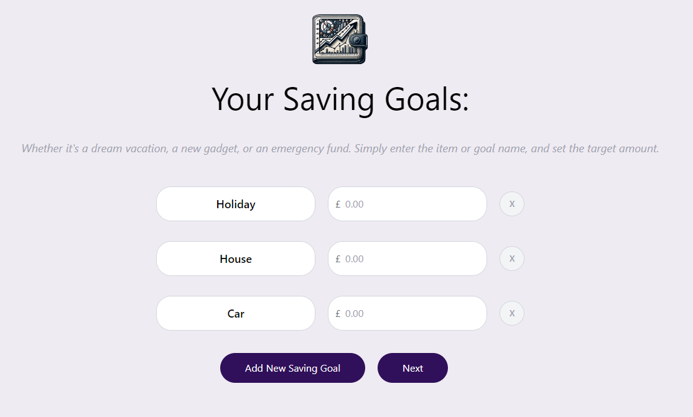
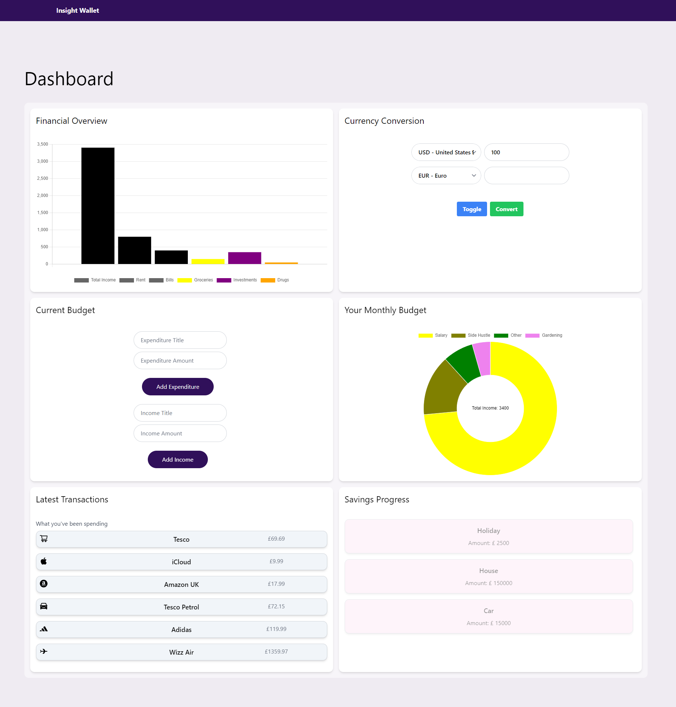

# Insight Wallet

## Description

Insight Wallet is a personal finance management web application designed to empower users on their journey to financial well-being. With Insight Wallet, users can effortlessly track their income streams, create and manage budgets, set and achieve savings goals, and gain valuable insights into their spending habits.

## Table of Contents

- [Requirements](#installation)
- [Installation](#installation)
- [Features](#features)
- [Built With](#tests)
- [Screenshots](#screenshots)
- [Contributors](#contributors)
- [Tests](#tests)
- [Credits](#tests)
- [License](#license)

## Requirements

Make sure you have the following tools installed on your machine:

- [Node.js](https://nodejs.org/) (includes npm)
- [Vite](https://vitejs.dev/)

## Installation

**Clone the repository:**
git clone https://github.com/MrKatrish/insight_wallet.git

1. Navigate to the project directory:
    - cd yourproject

2. Install dependencies using npm:
    - npm install

3. Start the development server:
    - npm run dev

This will launch the development server. Open your browser and visit http://localhost:3000 to view the application.

**To build the project for production, use:**
    - npm run build

## Features

1. Navigate Through the App:

- Home: The landing page with a brief introduction to Insight Wallet.
- Income: Input your income streams and details.
- Budget: Budget your expenditures and allocate funds to different categories.
- Savings Goals: Set and track your savings goals for various items or objectives.
- Dashboard: View an overview of your financial status and transactions.

2. Input Income:

- On the Income page, enter your various income sources and amounts.
- Click the "Next" button to proceed to the budgeting section.

3. Budget Your Expenditure:

- Allocate funds to different categories such as rent, bills, groceries, savings, and investments.
- Add new budget items as needed.
- The total budget amount is displayed at the bottom.

4. Set Savings Goals:
- On the Savings Goals page, enter items or goals you're saving for and their target amounts.
- Click the "Next" button to proceed.

5. View Dashboard:
- On the Dashboard, get an overview of your financial situation, including your savings, budget status, and recent transactions.

## Built With

A JavaScript library for building user interfaces.

 
The programming language used to create dynamic content on your website.

 
A utility-first CSS framework for rapidly building modern designs.

## Screenshots

[Our Working App - Click here!](https://insightwallet.netlify.app/)

## Contributors

1. [Paulina Siwko](https://github.com/paulinasiwko)
2. [Nirmean Sawi](https://github.com/Nirmean)
3. [Tomasz Jasinski](https://github.com/TomixJasina)
4. [Michal Paleczny](https://github.com/MrKatrish)
5. [Aijamal Jusupova](https://github.com/Aijus2022)
6. [Divine Ede](https://github.com/divine2192)
7. [Pawel Pochmara](https://github.com/Narkhashel)

## Tests

No tests available currently.

## Credits

Special thanks to our instructors and mentors for their guidance and support throughout this project.

## License

Distributed under the MIT License. See LICENSE.txt for more information.
